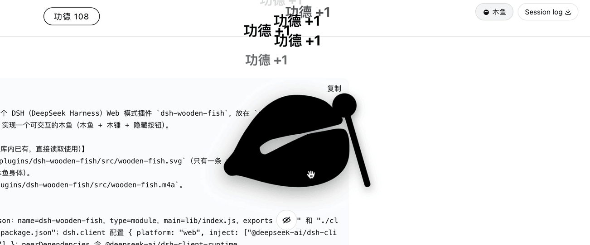

# dsh-wooden-fish

English | [中文](README.zh.md)

A DSH (DeepSeek Harness) web-mode plugin: shows a centered wooden fish (木鱼) and mallet over a blurred backdrop of the dsh web UI. Click the fish to strike it with the mallet, pop a "功德 +1" at the top, and hear "南无阿弥陀佛".



## Installation

### Install from npm (recommended)

```sh
dsh plugin --profile web add dsh-wooden-fish
```

### Install from GitHub

```sh
dsh plugin --profile web add github:your-org/dsh-wooden-fish
```

pnpm ≥10 blocks build scripts of git dependencies by default. After the first `add` fails, authorize this package's build in the profile's `pnpm-workspace.yaml`, then re-run the `add` command above:

```yaml
allowBuilds:
  dsh-wooden-fish: true
```

### Install locally

From the directory containing this plugin, install it into the profile as a local bundle:

```sh
dsh plugin --profile web add ./dsh-wooden-fish
```

## Usage

After installation, start in web mode:

```sh
dsh --profile web web
```

A wooden fish and mallet appear centered on the page, over a blurred view of the dsh web UI. Click the wooden fish to strike it.

## Features

- Renders a centered wooden fish and mallet in dsh web mode via the `shell.overlay` slot.
- Blurs the background with `backdrop-filter` while keeping the dsh web UI underneath click-through.
- On click, the mallet strikes the fish once, "功德 +1" pops up at the top, and the merit counter increments.
- Plays a knock sound (`wooden-fish.m4a`) and speaks "南无阿弥陀佛" (Web Speech API).
- The wooden fish, mallet, and merit counter follow the app appearance: black in light mode, white in dark mode.

## Development

The plugin is client-only: the host entry (`src/index.ts`) is an empty bundle stub, and all behavior lives in the browser entry (`src/client.tsx`). Build with esbuild:

```sh
npm install
npm run build
npm run typecheck
```

## FAQ

- **No sound / no speech on click?** The browser requires a user gesture to unlock audio, and `speechSynthesis` depends on a Chinese voice being installed in the OS/browser. Clicking the fish is the gesture; if speech still does not play, install a Chinese (`zh-CN`) voice in your system settings.
- **How do I hide the overlay?** Stop or uninstall the plugin, or reinstall to remove it. There is no in-page toggle.
